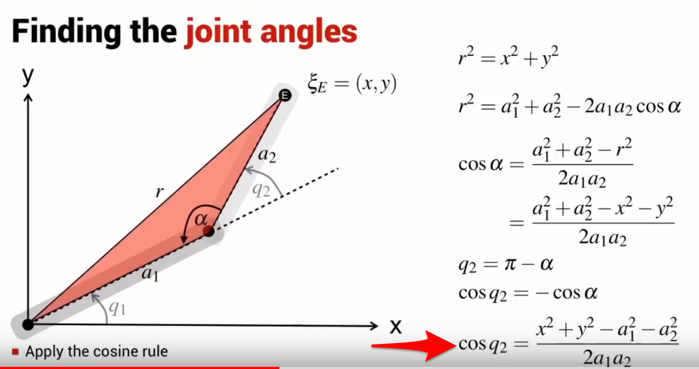
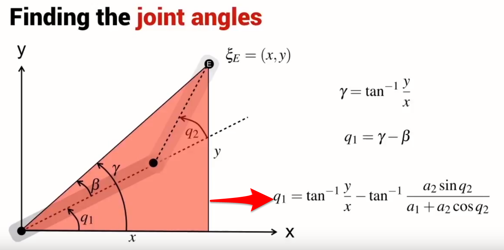

# Project: Kinematics Pick & Place

This writeup describes the process of implementing `IK_server.py` to generate joint angles of Kuka KR210 from the end effector poses and orientations.


The project can be downloaded from the [project repository](https://github.com/udacity/RoboND-Kinematics-Project). Refer to its README for enviroment setup.

**Steps to complete the project:** 

- Create DH parameter table
- Create transform and rotation matrix
- Joint angles of joint 1-3
- Joint angles of joint 4-6

## Create DH parameter table

DH table is a common convention to define the reference frames of a robot. 


- alpha_(i-1) (twist angle): angle between Z(i-1) and Z(i) measured about X(i-1)
- a_(i-1) (link length): distance from Z(i-1) to Z(i) measured along X(i-1)
- $d_i$ (link offset): signed distance from X(i-1) to X(i) measured along Z(i)
- theta(i) (joint angle): angle between X(i-1) and X(i) measured about Z(i)

Another good illustration can be also found [in the video](https://youtu.be/rA9tm0gTln8)

The DH table for KR210 robot:
Links | alpha(i-1) | a(i-1) | d(i-1) | theta(i)
--- | --- | --- | --- | ---
0->1 | 0 | 0 | 0.75 | q1
1->2 | - pi/2 | 0.35 | 0 | -pi/2 + q2
2->3 | 0 | 1.25 | 0 | 0
3->4 |  - pi/2 | -0.054 | 1.5 | q3
4->5 |  pi/2 | 0 | 0 | q4
5->6 | - pi/2 | 0 | 0 | q5
6->EE | 0 | 0 | 0.303 | q6

Codes are as follows
```python
DH_table = { alpha0:     0.,  a0:      0.,   d1:  0.75,   q1:         q1,
            alpha1: -pi/2.,  a1:    0.35,   d2:    0.,   q2: -pi/2. +q2,
            alpha2:     0.,  a2:    1.25,   d3:    0.,   q3:         q3,
            alpha3: -pi/2.,  a3:  -0.054,   d4:   1.5,   q4:         q4,
            alpha4:  pi/2.,  a4:      0.,   d5:    0.,   q5:         q5,
            alpha5: -pi/2.,  a5:      0.,   d6:    0.,   q6:         q6,
            alpha6:     0.,  a6:      0.,   d7: 0.303,   q7:         0.}
```
## Create transform and rotation matrix
Build the tranformation matrix and "*subs*" in the DH table for forward kinematics transformation matrics for each joint

```python
TF = Matrix([[ cos(q) ,       -sin(q),            0,                 a],
                [sin(q)*cos(alpha), cos(q)*cos(alpha), -sin(alpha), -sin(alpha)*d],
                [sin(q)*sin(alpha), cos(q)*sin(alpha),  cos(alpha),  cos(alpha)*d],
                [                0,                 0,           0,             1]])
```
```python
T0_1 = TF_Matrix(alpha0, a0, d1, q1).subs(DH_table)
T1_2 = TF_Matrix(alpha1, a1, d2, q2).subs(DH_table)
T2_3 = TF_Matrix(alpha2, a2, d3, q3).subs(DH_table)
T3_4 = TF_Matrix(alpha3, a3, d4, q4).subs(DH_table)
T4_5 = TF_Matrix(alpha4, a4, d5, q5).subs(DH_table)
T5_6 = TF_Matrix(alpha5, a5, d6, q6).subs(DH_table)
T6_EE = TF_Matrix(alpha6, a6, d7, q7).subs(DH_table)

T0_EE = T0_1 * T1_2 * T2_3 * T3_4 * T4_5 * T5_6 * T6_EE
```
Rotation matrix
```python
ROT_x = Matrix([[1, 0 , 0],
                [0, cos(r), -sin(r)],
                [0, sin(r), cos(r)]]) 

ROT_y = Matrix([[cos(p),    0 ,     sin(p)],
                [0,         1,  0],
                [-sin(p),   0,  cos(p)]]) 

ROT_z = Matrix([[cos(y), -sin(y), 0],
                [sin(y), cos(y), 0],
                [0, 0, 1]]) 
```
## Joint angles of joint 1-3
For a six degree of freedom serial manipulator with a spherical wrist, usually the first three joints are for controlling the position of the wrist center while the last three joints would orient the end effector as needed.

Therefore, we generate the first three joint angles, and then generate angles of joint 4-6.

To generate angle of joint 1-3, we apply the following rule ([reference](http://webcai.math.fcu.edu.tw/course/tri/ScAdd/ScAdd.html))




Codes
```python
theta1 = atan2(WC[1], WC[0])
side_a = 1.501
side_b = sqrt(pow((sqrt(WC[0] * WC[0] + WC[1] * WC[1]) - 0.35), 2) + pow((WC[2] - 0.75), 2))
side_c = 1.25
angle_a = acos((side_b * side_b + side_c * side_c - side_a * side_a) / (2 * side_b * side_c))
angle_b = acos((side_a * side_a + side_c * side_c - side_b * side_b) / (2 * side_a * side_c))
angle_c = acos((side_a * side_a + side_b * side_b - side_c * side_c) / (2 * side_a * side_b))
theta2 = pi / 2 - angle_a - atan2(WC[2] - 0.75, sqrt(WC[0] * WC[0] + WC[1] * WC[1]) - 0.35)
theta3 = pi / 2 - (angle_b + 0.036)
```

## Joint angles of joint 4-6
Use the transposed matrix R03 (rotation betweeb base and third joint), and ROT_EE (rotation betweeb base and end effector) to get R36.

Then we can get Euler Angles from R36
```python
R03 = T0_1[0:3, 0:3] * T1_2[0:3, 0:3] * T2_3[0:3, 0:3]
R03 = R03.evalf(subs={q1: theta1, q2: theta2, q3: theta3})
R36 = R03.transpose() * ROT_EE

theta5 = atan2(sqrt(R36[0,2]*R36[0,2] + R36[2,2]*R36[2,2]),R36[1,2])
if sin(theta5 ) < 0:
    theta4  = atan2(-R36[2,2], R36[0,2])
    theta6 = atan2(R36[1,1], -R36[1,0])
else:
    theta4 = atan2(R36[2,2], -R36[0,2])
    theta6 = atan2(-R36[1,1], R36[1,0])
```


